# BotWorkspace

<p align="center">
  
</p>

<p align="center">
  <strong>An independent, open-source native macOS workspace for named AI teammates.</strong><br>
  Built with SwiftUI, AppKit, Core Data, and Apple frameworks.
</p>

<p align="center">
  <a href="https://nat-build-with-oracle.github.io/idea-9sep-wed2026-grok-clone/">Feature atlas</a> ·
  <a href="https://nat-build-with-oracle.github.io/idea-9sep-wed2026-grok-clone/screenshots/">Screenshot gallery</a> ·
  <a href="https://github.com/nat-build-with-oracle/idea-9sep-wed2026-grok-clone/actions/workflows/pages.yml">Pages workflow</a>
</p>

> **Experimental source release.** This is an independent implementation informed by
> reference layouts and interaction ideas. It is not an official Grok Bot or Cursor
> product, does not include their private code or APIs, and does not ship a remote
> computer service.

The cover above is AI-generated concept art for this README. It is not a screenshot of
the running app. The verified native renders are in the [screenshot gallery](docs/screenshots/)
and the full screen-by-screen contract is in the [feature atlas](docs/FEATURE-ATLAS.md).

## What is BotWorkspace?

BotWorkspace is a local-first macOS workspace for people who want several named AI
teammates in one calm, messaging-style application. It provides:

- named Bots with editable profiles and visibility controls;
- direct conversations and ordered multi-Bot group rounds;
- drafts, replies, mentions, unread activity, and text attachments;
- configurable text providers with streamed output, Stop, Retry, and explicit consent;
- native routines with ownership, pause/resume, Run Now, history, and failure states;
- JSON export with secret-scrubbing and atomic replacement;
- a truthful disconnected computer panel until a separately reviewed adapter exists.

The project began as a Grok Bot-style interface idea capsule, but the shipped source is
an independent native rewrite. The app draws its own interface, avatars, controls, and
layout; private reference screenshots are not required to build or run it.

## Current status

| Area | Status |
|---|---|
| Native shell | SwiftUI/AppKit three-pane desktop workspace with saved appearance and pane preferences |
| Local data | Core Data v4, tested v1/v2/v3 migration, drafts, message pagination, routines, export v3 |
| Conversations | Direct chat, group chat, ordered recipients, per-member attribution, replies, mentions, unread state |
| Provider core | Endpoint/model selection, streamed text, queueing, Stop, Retry, offline URLProtocol fixtures |
| Credentials | Protected Keychain path or explicit session-only memory; experimental fixed-origin Codex import |
| Attachments | Text files only: native picker, managed copies, removable chips, destination/model consent |
| Routines | Interval/daily editor, owner/provider consent, Run Now, pause/resume, Stop/delete, history |
| Documentation | 55 documented screen/state IDs, 58 synthetic PNGs, 24 offline capture scenarios, HTML Pages site |
| Open gates | Broad live-provider compatibility, authorized signing/Keychain distribution, physical IME/VoiceOver and OS picker coverage |

No provider is configured by default. Without a usable credential, the app retains the
draft instead of pretending that an external generation succeeded.

## Quick start

### Requirements

- macOS 14 or newer;
- Xcode/Swift 6 toolchain;
- Python 3 only for the documentation and screenshot verification scripts;
- no third-party package installation and no API key for offline tests.

### Build and run the durable app

```sh
scripts/native-app.sh build
scripts/native-app.sh run
```

The ad-hoc app bundle is written to
`Prototypes/NativeShell/.build/BotWorkspace.app`. The durable workspace stores local
data in the macOS Application Support sandbox. It starts with no provider configured.

### Run the session-only prototype

```sh
scripts/native-prototype.sh build
scripts/native-prototype.sh run
scripts/native-prototype.sh snapshot
```

The prototype seeds synthetic in-memory conversations and does not contact a provider.
Use it for visual exploration; use `native-app.sh` for durable Core Data behavior.

## Provider setup and credentials

Settings includes templates for Z.ai general API, local 9router, OpenAI Platform, and
custom compatible providers. Enter an endpoint, model, and key explicitly, then select
the provider in the composer. Group messages require selecting one or more replying
Bots and reviewing their ordered requests.

The experimental Codex login path imports a user-selected ChatGPT `auth.json` for the
current process only. It is not an OpenAI Platform API key, does not refresh, and is
restricted to its documented fixed origin. Protected Keychain access still requires
authorized signing. For an ad-hoc local build, choose **This session only** so the key
remains in memory until quit; no plaintext credential file is created.

Read the [provider setup contract](docs/PROVIDER-SETUP.md),
[provider core limits](docs/PROVIDER-CORE.md), and
[Codex adapter contract](docs/CODEX-ADAPTER-CONTRACT.md) before testing a live account.

## Feature highlights

### Native workspace

- three-pane desktop shell with sidebar, conversation, and optional inspector;
- minimum-width behavior preserves the composer and collapses the inspector first;
- Dark, Light, and Follow System appearance with saved pane widths/visibility;
- searchable conversations, latest-message previews, timestamps, unread reply badges,
  hidden-chat recovery, and explicit empty/error states.

### Bots, groups, replies, and mentions

- create/edit Bot profiles and groups with detached edit buffers;
- stale profile snapshots require an explicit reload instead of overwriting newer edits;
- group recipient order is visible and preserved through consent and generation;
- typed/menu mentions are identity-safe, with duplicate-name disambiguation;
- reply references are conversation-scoped and preserve a two-line excerpt;
- Stop keeps completed group replies and cancels only remaining work.

### Attachments and export

- text attachments use a native file picker and atomic managed copies;
- chips can be removed before sending;
- every send discloses destination, model, content, and file metadata before credential lookup;
- export uses the native Save Panel and JSON format v3, with explicit secret-scrubbing limits;
- images are not a supported attachment type in this release.

### Routines

- interval and daily schedule editing;
- explicit routine owner/provider authorization;
- Run Now, pause/resume, Stop, delete, and history;
- launch/wake policy and 30-second awake execution are tested within the app boundary;
- no claim of a 24/7 background worker when the app is closed or the machine sleeps.

## Verification

The latest native verification snapshot reports **564 tests**: 300 WorkspaceCore tests
plus 264 native-shell tests, all passing. Coverage includes:

- Core Data migration, persistence, drafts, pagination, export, and deletion;
- provider streaming, queueing, Stop/Retry, errors, and offline fixtures;
- ordered group rounds, aggregate consent, cancellation, and mention routing;
- profile edits, conflict/discard behavior, replies, attachments, routines, and appearance;
- narrow-window rendering, Settings rendering, and build/signature checks.

Run the main test suite with:

```sh
scripts/native-app.sh test
```

Useful focused offline checks:

```sh
scripts/native-app.sh smoke
scripts/native-app.sh provider-smoke
scripts/native-app.sh provider-smoke --settings
scripts/native-app.sh codex-smoke --settings
scripts/native-app.sh profile-smoke
scripts/native-app.sh reply-smoke
scripts/native-app.sh attachment-smoke
scripts/native-app.sh group-smoke
scripts/native-app.sh mention-smoke
scripts/native-app.sh appearance-smoke
scripts/native-app.sh unread-smoke --fixture-foreground
scripts/native-app.sh export-smoke
scripts/native-app.sh deletion-smoke
scripts/native-app.sh routine-smoke
```

These commands use isolated synthetic fixtures. They do not require contributor
credentials or make billable live provider requests.

## Screen documentation and visual evidence

Start with the [complete feature atlas](docs/FEATURE-ATLAS.md). It maps every screen,
control, state, validation rule, persistence boundary, permission boundary, ASCII
layout, source citation, and evidence limitation.

- [Workspace screens W01–W19](docs/SCREENS-WORKSPACE.md)
- [Management and Settings screens M01–M20D](docs/SCREENS-MANAGEMENT.md)
- [Screenshot catalog and capture limitations](docs/SCREENSHOT-CATALOG.md)
- [Offline screenshot gallery](docs/screenshots/index.html)
- [Machine-readable screenshot manifest](docs/screenshots/manifest.json)
- [Reference-screen observations and neutral ASCII](docs/REFERENCE-SCREENS.md)
- [Computer/terminal boundary](docs/COMPUTER-TERMINAL-CONTRACT.md)

The public gallery contains only synthetic BotWorkspace renders: 58 PNG files from 24
offline scenarios. It does not publish user-supplied reference screenshots, private
runtime state, credentials, or infrastructure configuration.

<!-- UI_ATLAS_START -->
## UI atlas — every captured native screen

The README now includes every one of the **58 unique synthetic native UI renders**.
Click a thumbnail for the original PNG, or open the [searchable interactive gallery](docs/screenshots/index.html).
These are isolated offline fixtures—not live provider output, private reference images, or proof of physical mouse/keyboard behavior.

<details>
<summary>Show all 58 UI renders</summary>

<table>
<tr>
  <td align="center"><a href="docs/screenshots/sample-chat--desktop-chat.png">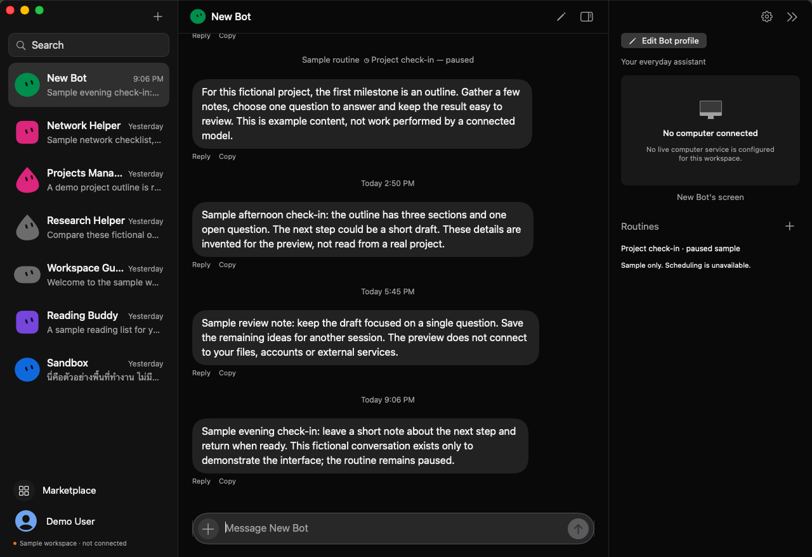</a><br><sub><code>sample-chat</code><br>sample-chat--desktop-chat.png</sub></td>
  <td align="center"><a href="docs/screenshots/sample-picker--desktop-picker.png">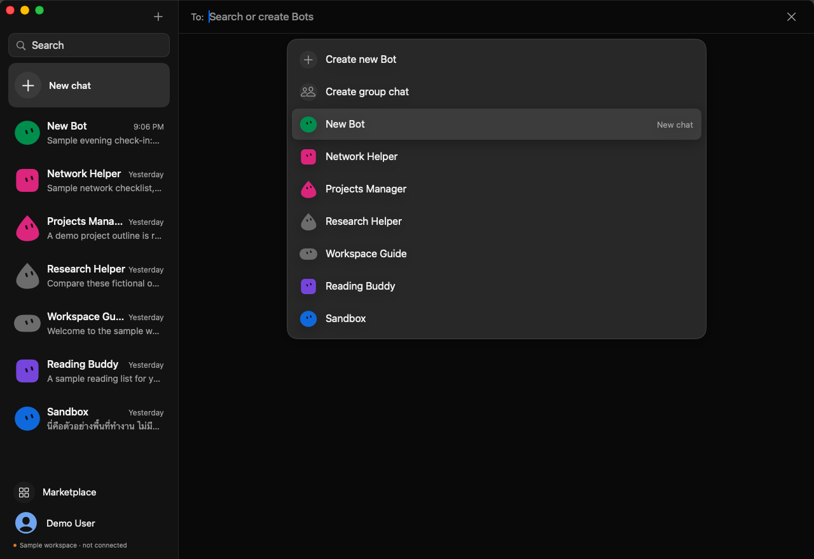</a><br><sub><code>sample-picker</code><br>sample-picker--desktop-picker.png</sub></td>
  <td align="center"><a href="docs/screenshots/sample-group-picker--desktop-group.png">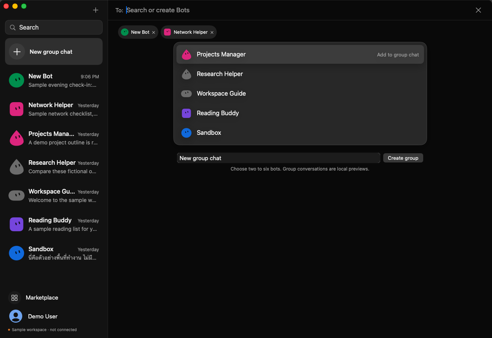</a><br><sub><code>sample-group-picker</code><br>sample-group-picker--desktop-group.png</sub></td>
  <td align="center"><a href="docs/screenshots/workspace--desktop-durable-workspace.png">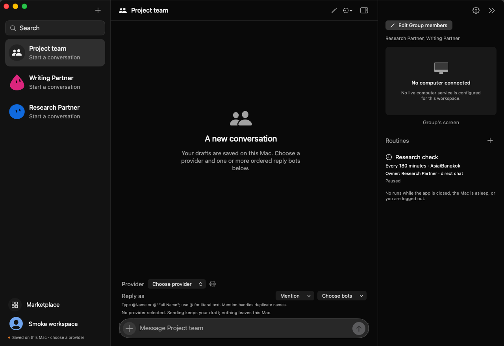</a><br><sub><code>workspace</code><br>workspace--desktop-durable-workspace.png</sub></td>
</tr>
<tr>
  <td align="center"><a href="docs/screenshots/workspace-minimum--small-durable-workspace.png">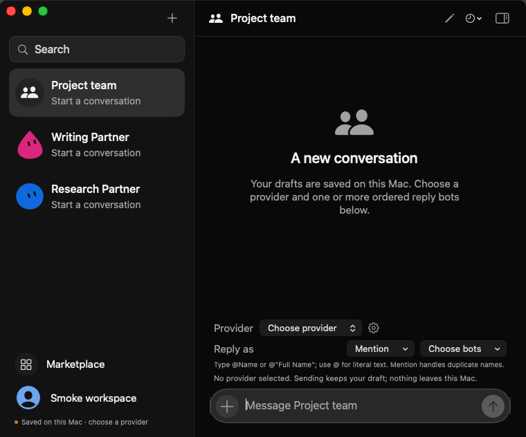</a><br><sub><code>workspace-minimum</code><br>workspace-minimum--small-durable-workspace.png</sub></td>
  <td align="center"><a href="docs/screenshots/provider-chat--desktop-provider-chat.png">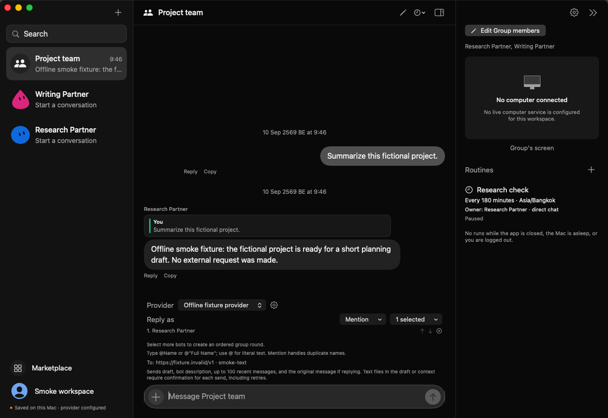</a><br><sub><code>provider-chat</code><br>provider-chat--desktop-provider-chat.png</sub></td>
  <td align="center"><a href="docs/screenshots/provider-settings--desktop-provider-settings.png"></a><br><sub><code>provider-settings</code><br>provider-settings--desktop-provider-settings.png</sub></td>
  <td align="center"><a href="docs/screenshots/router-settings--desktop-router-model-settings.png"></a><br><sub><code>router-settings</code><br>router-settings--desktop-router-model-settings.png</sub></td>
</tr>
<tr>
  <td align="center"><a href="docs/screenshots/codex-chat--desktop-codex-chat.png">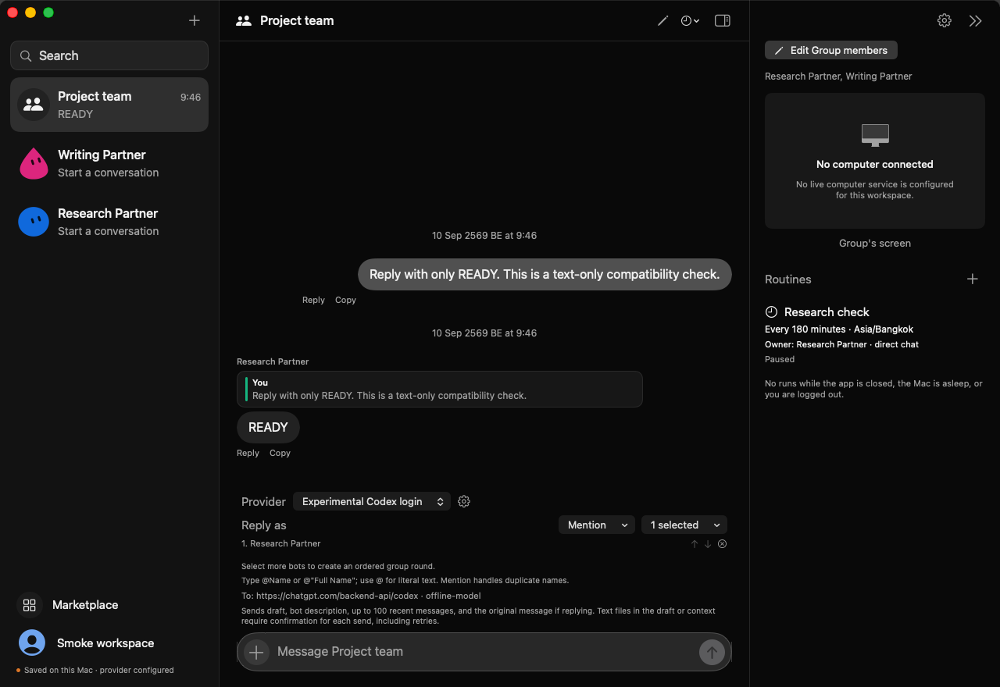</a><br><sub><code>codex-chat</code><br>codex-chat--desktop-codex-chat.png</sub></td>
  <td align="center"><a href="docs/screenshots/codex-settings--desktop-codex-settings.png">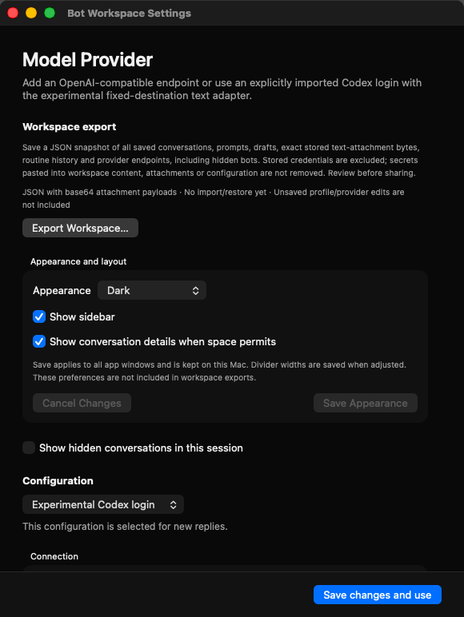</a><br><sub><code>codex-settings</code><br>codex-settings--desktop-codex-settings.png</sub></td>
  <td align="center"><a href="docs/screenshots/edit-bot--desktop-edit-bot.png">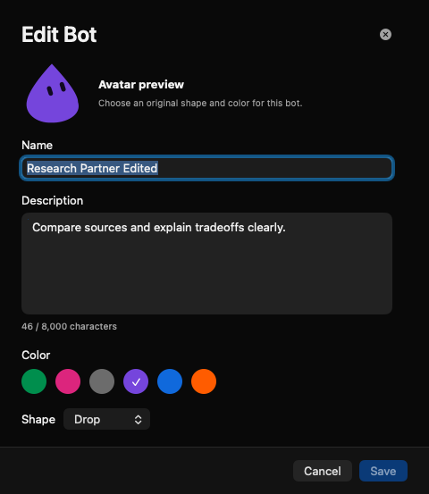</a><br><sub><code>edit-bot</code><br>edit-bot--desktop-edit-bot.png</sub></td>
  <td align="center"><a href="docs/screenshots/edit-group--desktop-edit-group.png">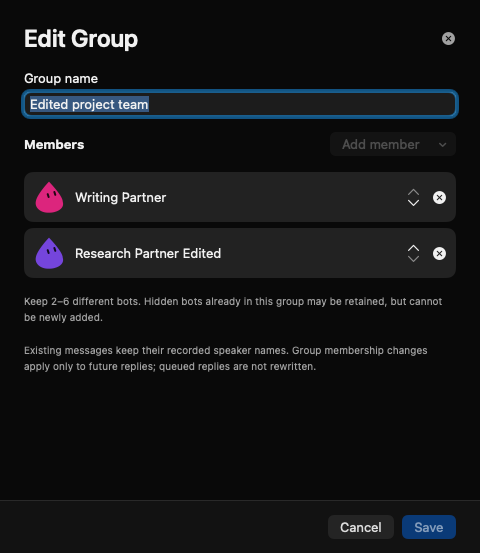</a><br><sub><code>edit-group</code><br>edit-group--desktop-edit-group.png</sub></td>
</tr>
<tr>
  <td align="center"><a href="docs/screenshots/reply--desktop-reply-chat.png">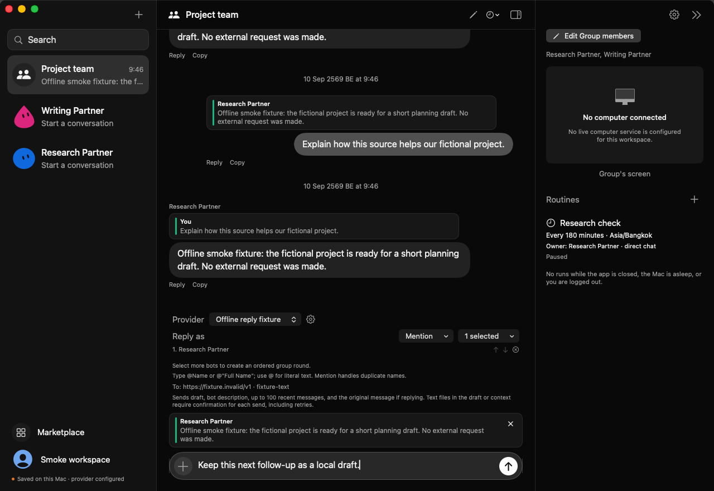</a><br><sub><code>reply</code><br>reply--desktop-reply-chat.png</sub></td>
  <td align="center"><a href="docs/screenshots/export--desktop-export-settings.png">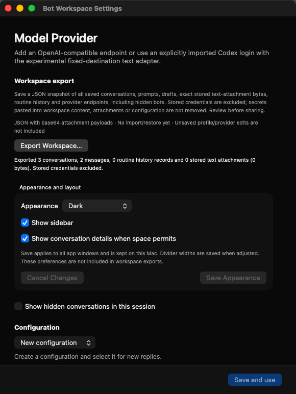</a><br><sub><code>export</code><br>export--desktop-export-settings.png</sub></td>
  <td align="center"><a href="docs/screenshots/deletion--desktop-delete-confirmation.png">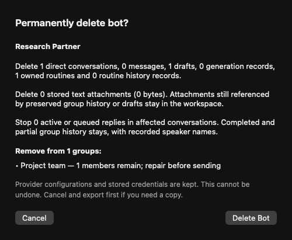</a><br><sub><code>deletion</code><br>deletion--desktop-delete-confirmation.png</sub></td>
  <td align="center"><a href="docs/screenshots/deletion--desktop-degraded-group.png">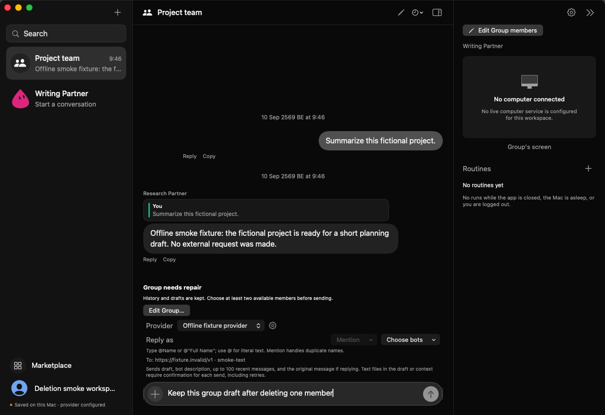</a><br><sub><code>deletion</code><br>deletion--desktop-degraded-group.png</sub></td>
</tr>
<tr>
  <td align="center"><a href="docs/screenshots/routine--desktop-routine-editor.png">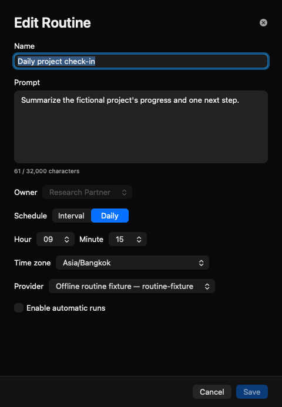</a><br><sub><code>routine</code><br>routine--desktop-routine-editor.png</sub></td>
  <td align="center"><a href="docs/screenshots/routine--desktop-routine-history.png">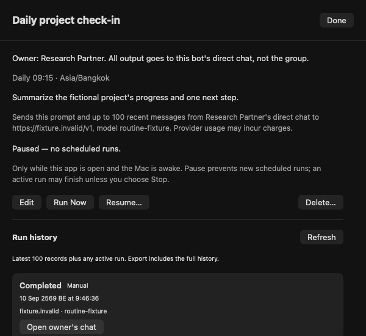</a><br><sub><code>routine</code><br>routine--desktop-routine-history.png</sub></td>
  <td align="center"><a href="docs/screenshots/attachment--desktop-attachment-confirmation.png">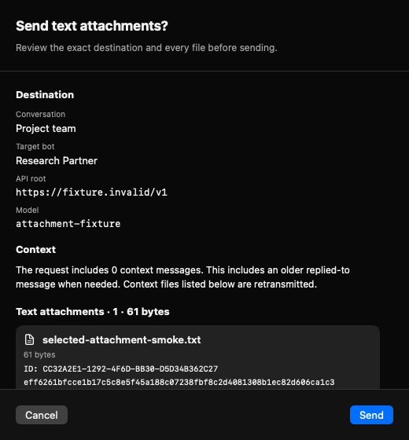</a><br><sub><code>attachment</code><br>attachment--desktop-attachment-confirmation.png</sub></td>
  <td align="center"><a href="docs/screenshots/attachment--desktop-durable-workspace.png">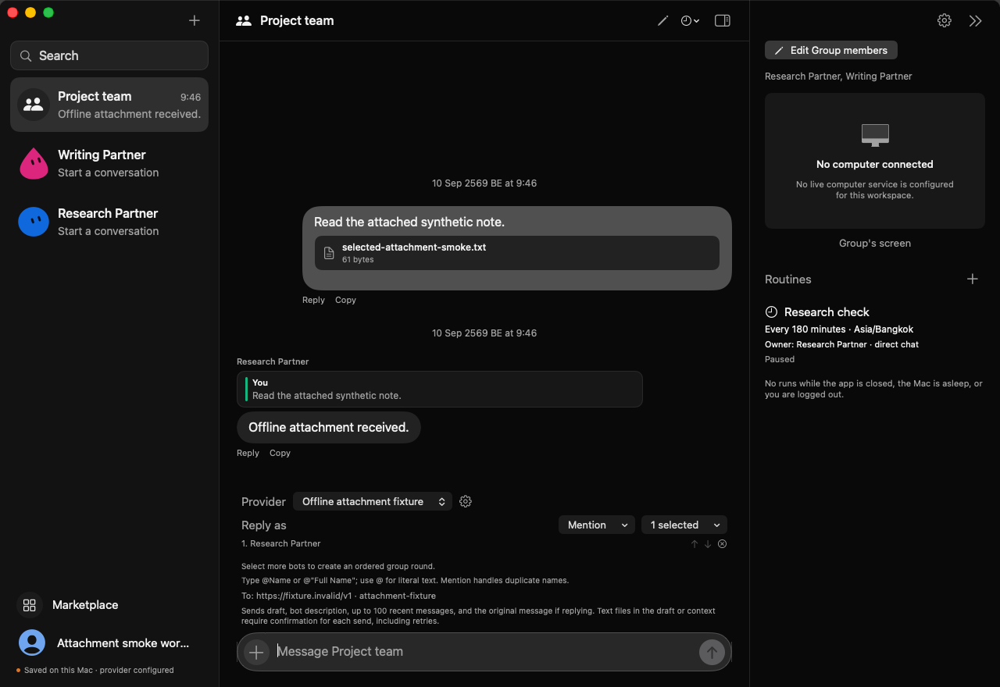</a><br><sub><code>attachment</code><br>attachment--desktop-durable-workspace.png</sub></td>
</tr>
<tr>
  <td align="center"><a href="docs/screenshots/appearance--desktop-appearance-light-workspace.png"></a><br><sub><code>appearance</code><br>appearance--desktop-appearance-light-workspace.png</sub></td>
  <td align="center"><a href="docs/screenshots/appearance--desktop-appearance-light-settings.png"></a><br><sub><code>appearance</code><br>appearance--desktop-appearance-light-settings.png</sub></td>
  <td align="center"><a href="docs/screenshots/appearance--desktop-appearance-dark-workspace.png"></a><br><sub><code>appearance</code><br>appearance--desktop-appearance-dark-workspace.png</sub></td>
  <td align="center"><a href="docs/screenshots/appearance--desktop-appearance-dark-settings.png"></a><br><sub><code>appearance</code><br>appearance--desktop-appearance-dark-settings.png</sub></td>
</tr>
<tr>
  <td align="center"><a href="docs/screenshots/appearance--desktop-appearance-system-workspace.png">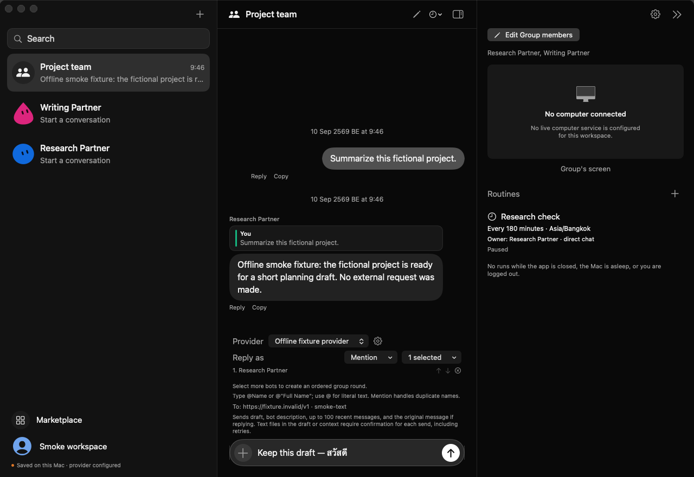</a><br><sub><code>appearance</code><br>appearance--desktop-appearance-system-workspace.png</sub></td>
  <td align="center"><a href="docs/screenshots/appearance--desktop-appearance-system-settings.png">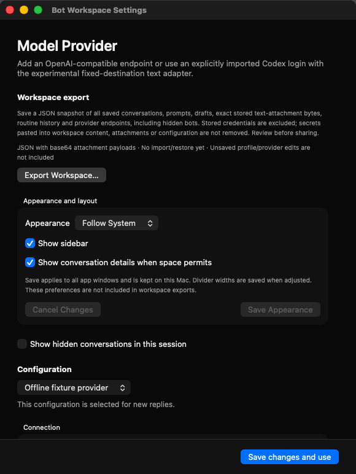</a><br><sub><code>appearance</code><br>appearance--desktop-appearance-system-settings.png</sub></td>
  <td align="center"><a href="docs/screenshots/appearance--desktop-durable-workspace.png">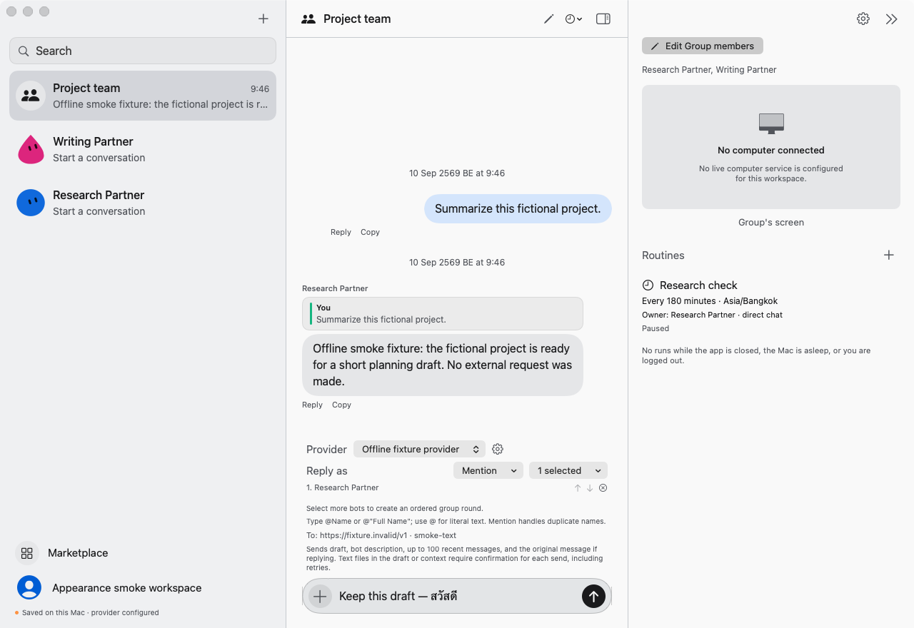</a><br><sub><code>appearance</code><br>appearance--desktop-durable-workspace.png</sub></td>
  <td align="center"><a href="docs/screenshots/appearance-minimum--small-appearance-light-workspace.png">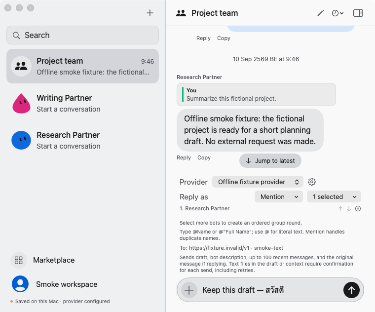</a><br><sub><code>appearance-minimum</code><br>appearance-minimum--small-appearance-light-workspace.png</sub></td>
</tr>
<tr>
  <td align="center"><a href="docs/screenshots/appearance-minimum--small-appearance-light-settings.png">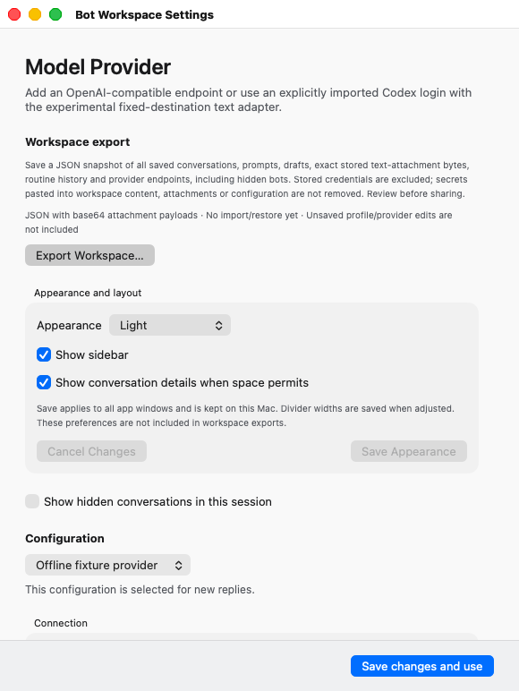</a><br><sub><code>appearance-minimum</code><br>appearance-minimum--small-appearance-light-settings.png</sub></td>
  <td align="center"><a href="docs/screenshots/appearance-minimum--small-appearance-dark-workspace.png"></a><br><sub><code>appearance-minimum</code><br>appearance-minimum--small-appearance-dark-workspace.png</sub></td>
  <td align="center"><a href="docs/screenshots/appearance-minimum--small-appearance-dark-settings.png"></a><br><sub><code>appearance-minimum</code><br>appearance-minimum--small-appearance-dark-settings.png</sub></td>
  <td align="center"><a href="docs/screenshots/appearance-minimum--small-appearance-system-workspace.png">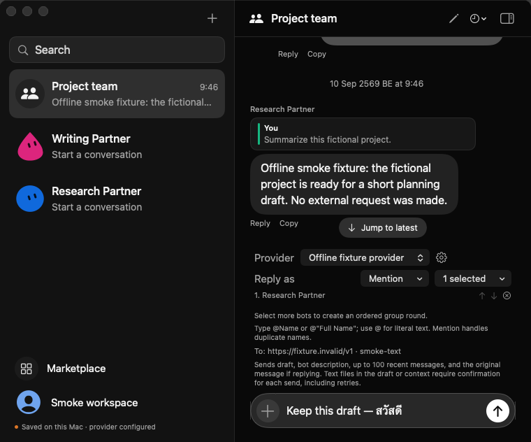</a><br><sub><code>appearance-minimum</code><br>appearance-minimum--small-appearance-system-workspace.png</sub></td>
</tr>
<tr>
  <td align="center"><a href="docs/screenshots/appearance-minimum--small-appearance-system-settings.png"></a><br><sub><code>appearance-minimum</code><br>appearance-minimum--small-appearance-system-settings.png</sub></td>
  <td align="center"><a href="docs/screenshots/appearance-minimum--small-durable-workspace.png">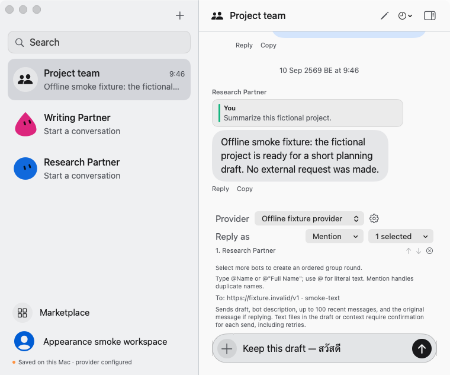</a><br><sub><code>appearance-minimum</code><br>appearance-minimum--small-durable-workspace.png</sub></td>
  <td align="center"><a href="docs/screenshots/unread--desktop-unread-dark-before.png">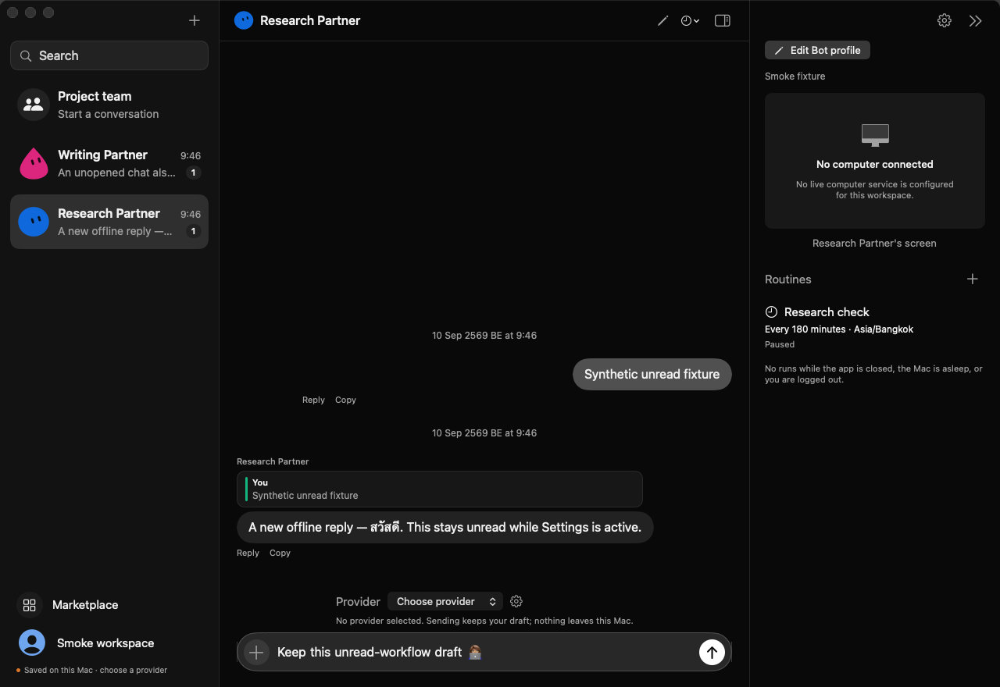</a><br><sub><code>unread</code><br>unread--desktop-unread-dark-before.png</sub></td>
  <td align="center"><a href="docs/screenshots/unread--desktop-unread-light-before.png"></a><br><sub><code>unread</code><br>unread--desktop-unread-light-before.png</sub></td>
</tr>
<tr>
  <td align="center"><a href="docs/screenshots/unread--desktop-unread-after.png"></a><br><sub><code>unread</code><br>unread--desktop-unread-after.png</sub></td>
  <td align="center"><a href="docs/screenshots/unread--desktop-durable-workspace.png">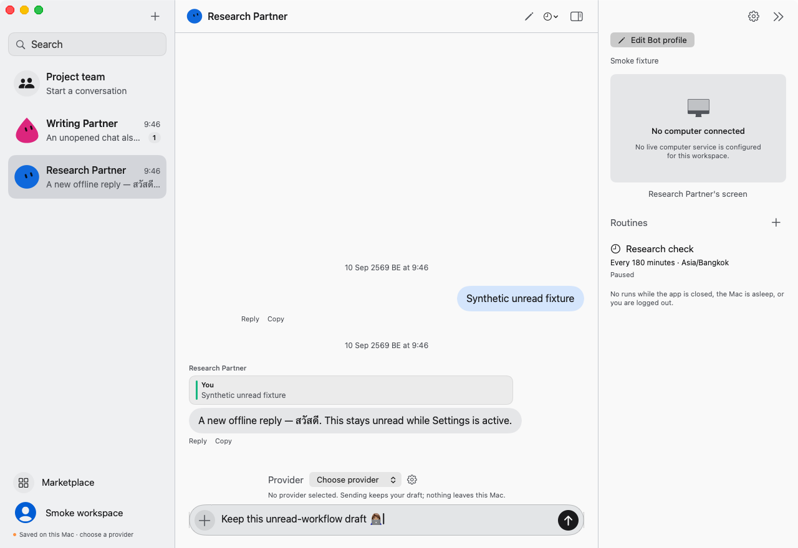</a><br><sub><code>unread</code><br>unread--desktop-durable-workspace.png</sub></td>
  <td align="center"><a href="docs/screenshots/group-round--desktop-group-composer-light.png">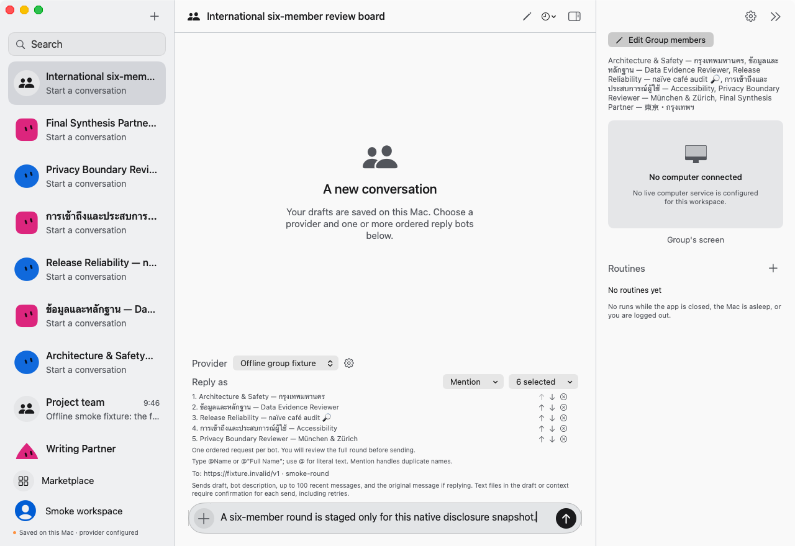</a><br><sub><code>group-round</code><br>group-round--desktop-group-composer-light.png</sub></td>
  <td align="center"><a href="docs/screenshots/group-round--desktop-group-composer-dark.png">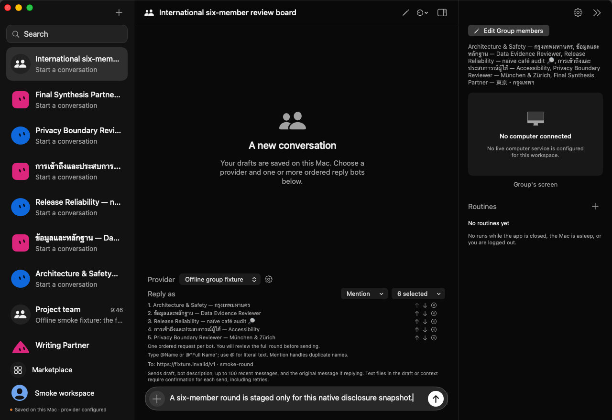</a><br><sub><code>group-round</code><br>group-round--desktop-group-composer-dark.png</sub></td>
</tr>
<tr>
  <td align="center"><a href="docs/screenshots/group-round--desktop-group-round-confirmation.png"></a><br><sub><code>group-round</code><br>group-round--desktop-group-round-confirmation.png</sub></td>
  <td align="center"><a href="docs/screenshots/group-round-minimum--small-group-composer-light.png">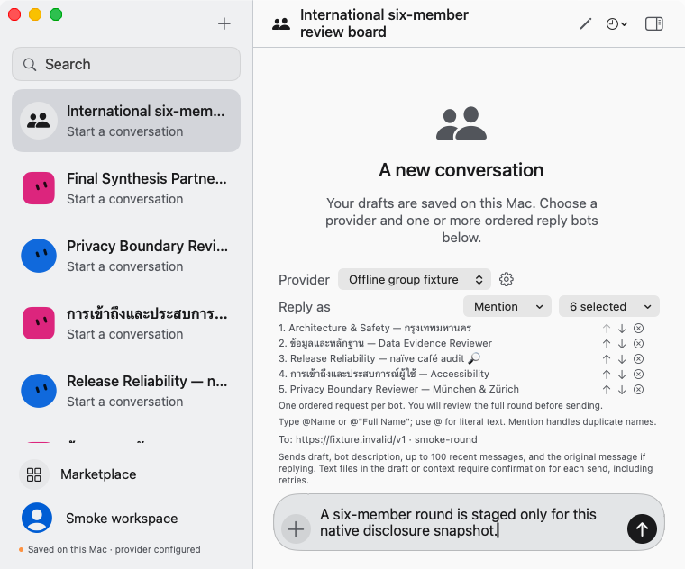</a><br><sub><code>group-round-minimum</code><br>group-round-minimum--small-group-composer-light.png</sub></td>
  <td align="center"><a href="docs/screenshots/group-round-minimum--small-group-composer-dark.png">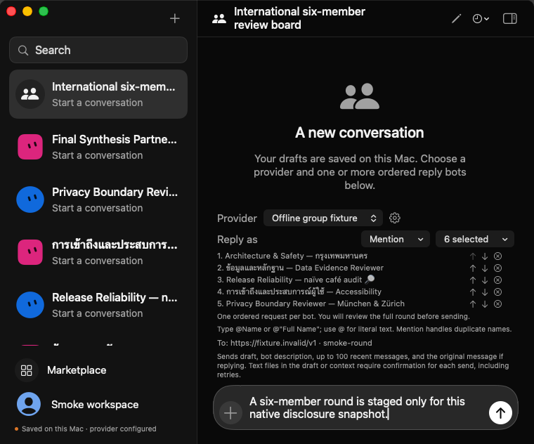</a><br><sub><code>group-round-minimum</code><br>group-round-minimum--small-group-composer-dark.png</sub></td>
  <td align="center"><a href="docs/screenshots/group-round-minimum--small-group-round-confirmation.png">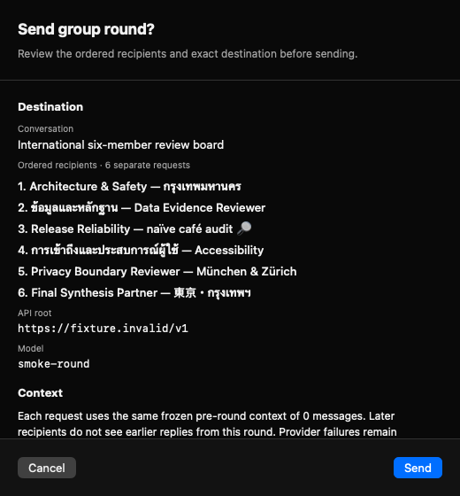</a><br><sub><code>group-round-minimum</code><br>group-round-minimum--small-group-round-confirmation.png</sub></td>
</tr>
<tr>
  <td align="center"><a href="docs/screenshots/mention--desktop-mention-composer-light.png">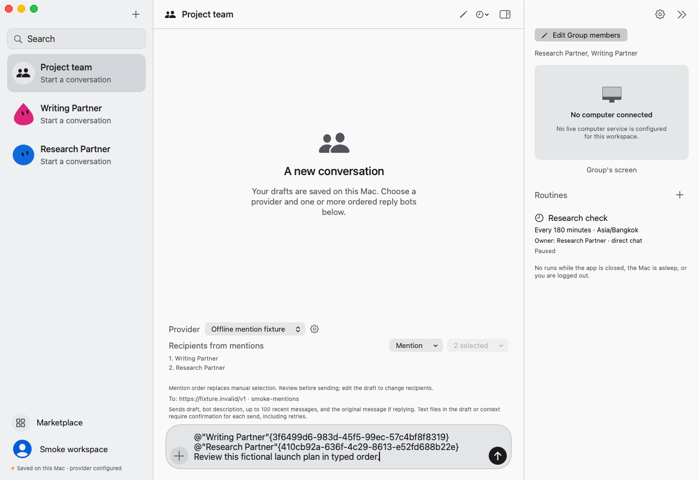</a><br><sub><code>mention</code><br>mention--desktop-mention-composer-light.png</sub></td>
  <td align="center"><a href="docs/screenshots/mention--desktop-mention-composer-dark.png">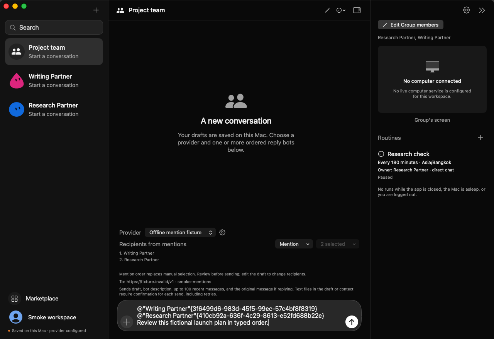</a><br><sub><code>mention</code><br>mention--desktop-mention-composer-dark.png</sub></td>
  <td align="center"><a href="docs/screenshots/mention--desktop-mention-confirmation-light.png"></a><br><sub><code>mention</code><br>mention--desktop-mention-confirmation-light.png</sub></td>
  <td align="center"><a href="docs/screenshots/mention--desktop-mention-confirmation-dark.png">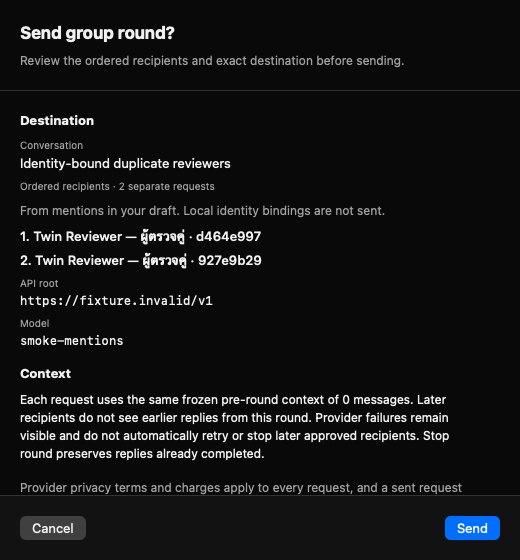</a><br><sub><code>mention</code><br>mention--desktop-mention-confirmation-dark.png</sub></td>
</tr>
<tr>
  <td align="center"><a href="docs/screenshots/mention--desktop-mention-invalid-light.png">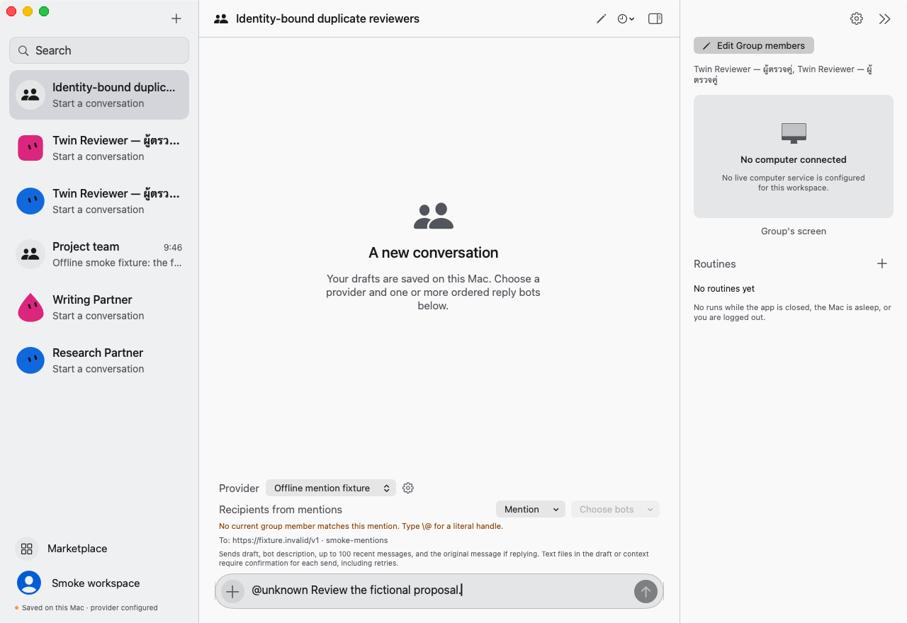</a><br><sub><code>mention</code><br>mention--desktop-mention-invalid-light.png</sub></td>
  <td align="center"><a href="docs/screenshots/mention--desktop-mention-invalid-dark.png">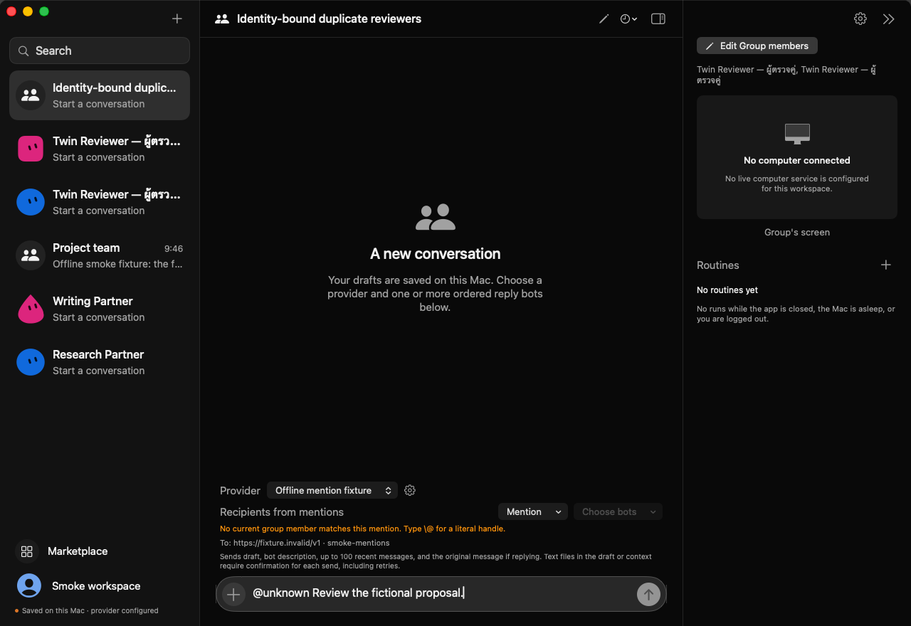</a><br><sub><code>mention</code><br>mention--desktop-mention-invalid-dark.png</sub></td>
  <td align="center"><a href="docs/screenshots/mention--desktop-durable-workspace.png"></a><br><sub><code>mention</code><br>mention--desktop-durable-workspace.png</sub></td>
  <td align="center"><a href="docs/screenshots/mention-minimum--small-mention-composer-light.png">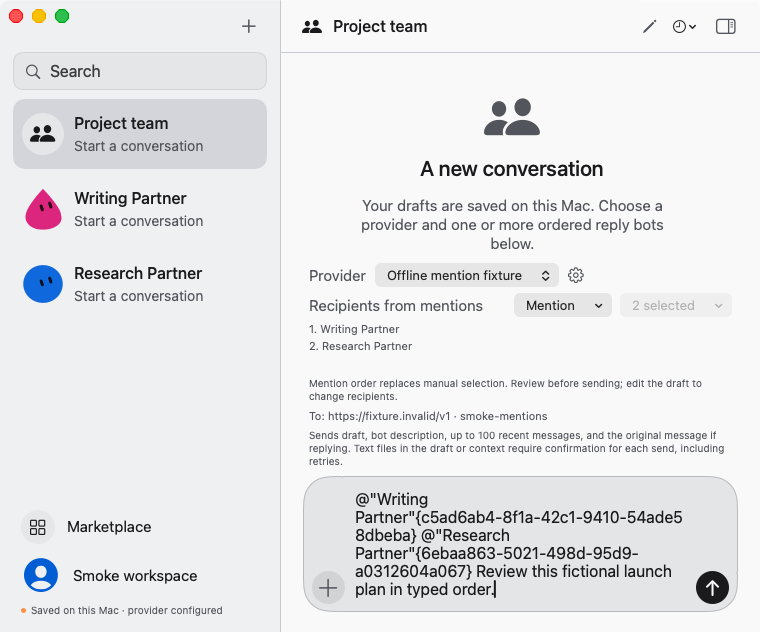</a><br><sub><code>mention-minimum</code><br>mention-minimum--small-mention-composer-light.png</sub></td>
</tr>
<tr>
  <td align="center"><a href="docs/screenshots/mention-minimum--small-mention-composer-dark.png">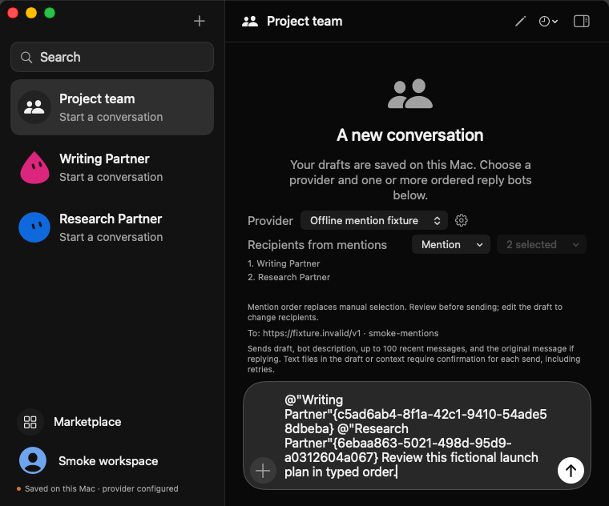</a><br><sub><code>mention-minimum</code><br>mention-minimum--small-mention-composer-dark.png</sub></td>
  <td align="center"><a href="docs/screenshots/mention-minimum--small-mention-confirmation-light.png">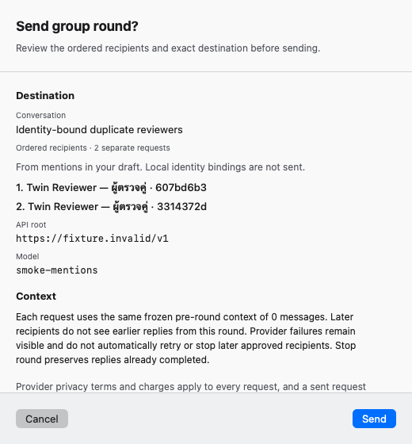</a><br><sub><code>mention-minimum</code><br>mention-minimum--small-mention-confirmation-light.png</sub></td>
  <td align="center"><a href="docs/screenshots/mention-minimum--small-mention-confirmation-dark.png"></a><br><sub><code>mention-minimum</code><br>mention-minimum--small-mention-confirmation-dark.png</sub></td>
  <td align="center"><a href="docs/screenshots/mention-minimum--small-mention-invalid-light.png">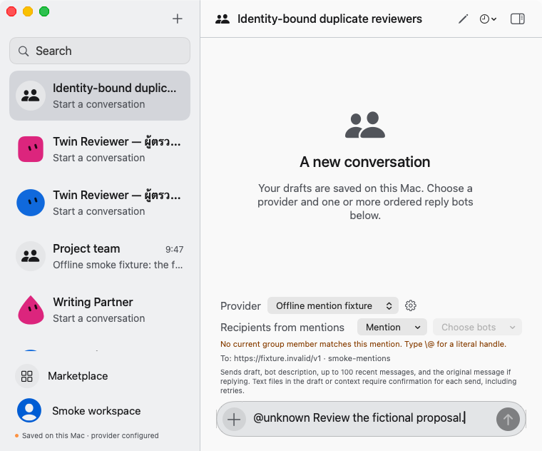</a><br><sub><code>mention-minimum</code><br>mention-minimum--small-mention-invalid-light.png</sub></td>
</tr>
<tr>
  <td align="center"><a href="docs/screenshots/mention-minimum--small-mention-invalid-dark.png">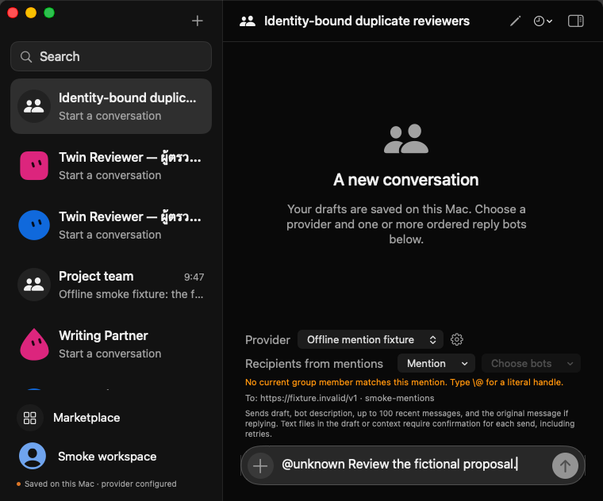</a><br><sub><code>mention-minimum</code><br>mention-minimum--small-mention-invalid-dark.png</sub></td>
  <td align="center"><a href="docs/screenshots/mention-minimum--small-durable-workspace.png"></a><br><sub><code>mention-minimum</code><br>mention-minimum--small-durable-workspace.png</sub></td>
</tr>
</table>

</details>
<!-- UI_ATLAS_END -->

## Architecture

```text
SwiftUI + AppKit
        │
        ▼
Presentation adapter / native workspace views
        │
        ▼
WorkspaceRepository ───────────────► Core Data v4
        │                                  │
        ├── drafts, messages, groups       ├── migrations
        ├── profile edits                  ├── routines/history
        └── export snapshots               └── local workspace state

Native Settings + Composer
        │
        ▼
GenerationCoordinator
        ├── CredentialStore
        ├── ChatProvider / Codex adapter
        └── URLSession + streamed events
```

The current computer inspector is intentionally disconnected. There is no embedded
remote desktop, terminal, shell executor, private endpoint, or automatic computer
connection in this repository.

## GitHub Pages documentation site

The static [HTML feature atlas](https://nat-build-with-oracle.github.io/idea-9sep-wed2026-grok-clone/)
and [HTML screenshot gallery](https://nat-build-with-oracle.github.io/idea-9sep-wed2026-grok-clone/screenshots/)
are published by `.github/workflows/pages.yml`.

Pages serves documentation and synthetic PNGs only. It does not run the macOS app,
provider backends, model requests, or remote terminal sessions.

After changing public contracts, regenerate and verify the allowlisted site:

```sh
python3 -B scripts/build-pages.py --render
python3 -B scripts/test-screen-atlas.py
python3 -B scripts/test-build-pages.py
python3 -B scripts/verify-screen-atlas.py
python3 -B scripts/build-pages.py --check
python3 -B scripts/build-pages.py --output _site
```

Use a fresh output directory for each local assembly; the builder refuses to overwrite
non-empty output. CI uploads only `_site`, after the privacy, hash, link, anchor, and
freshness checks pass.

## Repository map

```text
Packages/WorkspaceCore/          Core Data, repository, provider, and domain tests
Prototypes/NativeShell/          SwiftUI/AppKit app, preview, and native-shell tests
docs/                            Product contracts, screen catalogs, and gallery sources
docs/assets/                     Public README artwork and documentation assets
scripts/native-app.sh            Durable app build, test, and offline smoke entry point
scripts/native-prototype.sh      Session-only prototype build and snapshot entry point
scripts/capture-screen-atlas.py  Isolated synthetic screenshot capture
scripts/verify-screen-atlas.py   Screenshot/document completeness verifier
scripts/build-pages.py           Static HTML renderer and Pages artifact assembler
site/                            Committed generated HTML used by the Pages workflow
```

## Contributing

Read [CONTRIBUTING.md](CONTRIBUTING.md), the [product contract](docs/NATIVE-REWRITE-CONTRACT.md),
and the [durable-workspace checkpoint](docs/DURABLE-WORKSPACE.md) first.

```sh
scripts/native-app.sh test
xcrun swift-format lint --strict --recursive \
  Packages/WorkspaceCore/Sources Packages/WorkspaceCore/Tests \
  Prototypes/NativeShell/Sources Prototypes/NativeShell/Tests
bash -n scripts/native-app.sh scripts/native-prototype.sh
git diff --check
```

Contribution boundaries:

- keep changes focused and add regression tests for changed behavior;
- use original code/assets; do not submit extracted reference-app code, private endpoints,
  credentials, workspace databases, signing material, or personal conversations;
- keep provider tests offline with URLProtocol/protocol fixtures;
- never run the separately authorized live Codex stdin diagnostic automatically;
- preserve explicit consent, draft-on-failure, stale-edit rejection, export scrubbing,
  and honest disconnected states;
- document verification gaps instead of presenting a fixture as live compatibility.

## Known limitations

- Real provider compatibility is not broad release certification; one authorized account
  check does not cover every endpoint, model, quota, or account state.
- Authorized Keychain access, notarized distribution, and full signing validation remain open.
- Physical keyboard/IME, VoiceOver, OS file-picker grants, sleep/wake, and some native
  accessibility/error-dialog paths still require manual verification.
- The computer panel is a disconnected placeholder; no graphical desktop or terminal
  adapter is implemented.
- Text attachments are supported; image attachments are not.
- Routines require the app/machine lifecycle defined by the routine contract; there is
  no hidden always-on worker.

## License and provenance

Original source and documentation are licensed under [MIT](LICENSE).
Third-party names and marks remain the property of their respective owners. The original
reference screenshots, extracted app bundles, credentials, workspace data, private memory,
and runtime artifacts are intentionally excluded from the public source. The repository's
original [idea capsule](PROPOSAL.md) is retained as provenance, not as a claim of affiliation.
